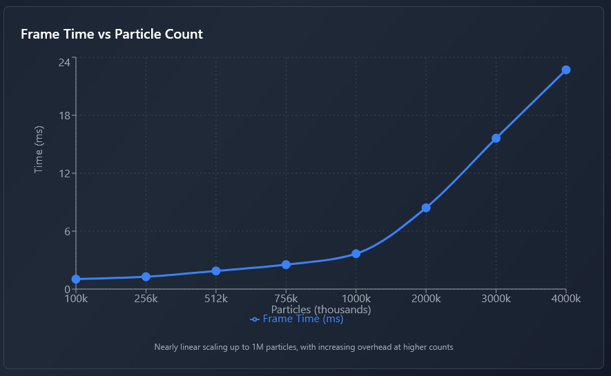

# GPU Physics Engine 🚀

A high-performance 2D physics engine built with Rust and wgpu, leveraging GPU compute shaders for massive parallel processing of physics simulations.

[](https://www.youtube.com/watch?v=TxYFeai6B9Q)

[Demo on YouTube](https://www.youtube.com/watch?v=TxYFeai6B9Q)


## ✨ Features

- **GPU-Accelerated**: All physics computations run on the GPU for maximum performance
- **Spatial Grid Partitioning**: Efficient broad-phase collision detection using GPU-based spatial grids. **Learn more**: [NVIDIA GPU Gems - Broad-Phase Collision Detection](https://developer.nvidia.com/gpugems/gpugems3/part-v-physics-simulation/chapter-32-broad-phase-collision-detection-cuda)
- **Verlet Integration**: Stable numerical integration for smooth particle motion
- **Real-time Interaction**: Interactive particle spawning and mouse-based attraction forces
- **Scalable**: Handle millions of particles with high framerates

## 🎮 Controls

| Input | Action |
|-------|--------|
| `W` or `↑` | Move camera up |
| `A` or `←` | Move camera left |
| `S` or `↓` | Move camera down |
| `D` or `→` | Move camera right |
| `P` | Spawn 100 particles at mouse position |
| `Left Click` | Attract particles to mouse |
| `Mouse Wheel` | Zoom in/out |

## 🚀 Quick Start
### Running the Engine
```bash
cargo run --release
```
### Tests
```
cargo test
```

### Benchmark
The benchmark shows the performance for each of the compute shaders at the end of the execution. It creates `benchmark.json` file that can be visualized at `edge://tracing/` or `chrome://tracing/`. 
```
cargo run --release --features benchmark
```


## 🔧 Implementation Details

### GPU Spatial Grid Partitioning
The engine uses a sophisticated spatial partitioning system that divides the simulation space into a uniform grid. Each particle is assigned to grid cells, dramatically reducing the number of collision checks from O(n²) to approximately O(n*k) in most cases.

**Learn more**: [NVIDIA GPU Gems - Broad-Phase Collision Detection](https://developer.nvidia.com/gpugems/gpugems3/part-v-physics-simulation/chapter-32-broad-phase-collision-detection-cuda)

### GPU Collision Response
All collision detection and response calculations are performed in parallel on the GPU using compute shaders, allowing for real-time simulation of millions of interacting particles.

### Verlet Integration
The engine employs Verlet integration for numerical stability and energy conservation, ensuring smooth and realistic particle motion over time.

## Morton encoding
Every 4 seconds, the particles are sorted using morton codes to improve cache locality. 

### Current Limitations
- **2D Only**: Currently supports 2D simulations
- **Circle Shapes**: Only circular particles are supported at this time

## 📊 Performance

**Test Configuration:**
- **GPU**: AMD Radeon RX 6800 XT (with severe thermal throttling)
- **OS**: Windows 11
- **Build**: Release mode (`--release`)
- **Gravity**: disabled

The engine demonstrates excellent scaling characteristics, maintaining smooth framerates even with millions of active particles thanks to GPU parallelization.


| Particles | Frame Time |
|-----------|------------|
| 100,000   | 1.03 ms    |
| 256,000   | 1.28 ms    |
| 512,000   | 1.88 ms    |
| 756,000   | 2.53 ms    |
| 1,000,000 | 3.66 ms    |
| 2,000,000 | 8.417 ms   |
| 3,000,000 | 15.62 ms   |
| 4,000,000 | 22.70 ms   |

## 🔮 Future Enhancements

- Compute shaders optimization
- Rendering optimization
- Improve physics


---

*Built with ❤️ using Rust and wgpu*
